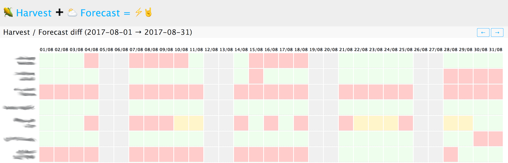
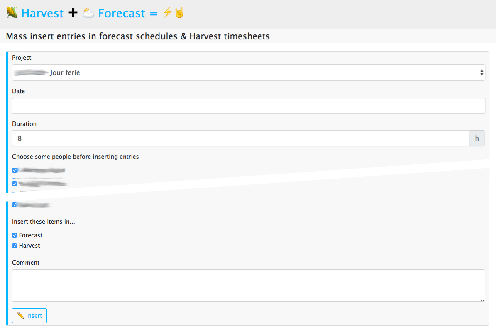

# Harvest Forecast tools

This projects contains several useful additions to [Harvest](https://www.getharvest.com/) and [Forecast](https://www.getharvest.com/forecast), two time tracking and scheduling applications:

 * Harvest Timesheets and Forecast schedules comparison at the team scale;
 * Generate a days-off summary as a markdown list, from both Harvest and Forecast;
 * Mass team insertions of Harvest timesheets and Forecast schedules entries.

⚠️ Forecast APIs are not official, and may break or change from one day to another<br />
⚠️ This is a Proof Of Concept, far from perfect. Feel free to improve :)

## Features

### Timesheets and schedules reconciliation

Validating timesheets using Harvest is a pain, as there's no way to check it against Forecast schedules. The main feature of this tool is to compare both in a graphical way:



Each day is attached a color, which describes the matching status:

 * green if all Harvest entries match the exact same project in Forecast, with the same duration;
 * orange if all Harvest entries match the same client in Forecast, with the same duration (in case the user has made a mistake on the project);
 * red if there's an important difference:
   * the durations do not match;
   * the projects do not match and the client is listed in the `harvest_nonreconciliable_client_ids` configuration directive.

In its invoicing process, the company can then track mistakes, edit Harvest timesheets or Forecast entries until the whole grid gets green: this means that Harvest timesheets and Forecast schedules are coherent, and hence the invoices can be created and sent.

### Mass team insertions

It happens several times a year when you want to add the same entry on the same day to all users in Forecast or Harvest (public holidays, conferences, incentive or team building, company-wide project, etc.). Doing so in Forecast and Harvest is a quite long story for now and involves repeating many clicks. This tool allows to mass-insert entries in Harvest timesheets and/or Forecast schedules.



### Day-off summary

This feature generates a "day off summary" for a given period, in markdown format.

## Pre-requisites

 * nodejs
 * redis
 * yarn
 * run `yarn install`

## Configure

Copy and edit the `.env` configuration file:

```
$ cp .env.dist .env
```

Edit the configuration options:

 * `harvest_id_client_id`: the `Client ID` of your OAuth client (create it at https://id.getharvest.com/oauth2/clients/new), eg. `harvest_id_client_id=your-oauth-client-id`
 * `harvest_id_client_secret`: the `Client Secret` of your OAuth client (create it at https://id.getharvest.com/oauth2/clients/new), eg. `harvest_id_client_secret=your-oauth-client-secret`
 * `harvest_id_client_redirect_uri`: the OAuth redirect URI, eg. `harvest_id_client_redirect_uri=http://localhost:3000/auth/code`
 * `forecast_insert_default_project_id`: id of the default project to use in the mass-insertion form. For instance, set it to a public holidays project, if you have one. eg. `forecast_insert_default_project_id=12345`
 * `harvest_holiday_projects`: a comma-separated list of project ids which may appear in the holidays summary page, eg. `harvest_holiday_projects=comma-separated-project-ids`
 * `harvest_nonreconciliable_client_ids`: a comma-separated list of clients ids that do not trigger the half-reconciliation, eg. `harvest_nonreconciliable_client_ids=a-comma-separated-list-of-harvest-client-ids`

## Run

Run the dev server using the `yarn run start` command, then head to [http://localhost:3000/](http://localhost:3000/).

## Development

Run the dev server using the `yarn run dev` command, then head to [http://localhost:3000/](http://localhost:3000/).

You may prettify your code using [prettier](https://prettier.io/) with the command:

```
$ yarn run prettier
```

## Todo

 * add a weekly recap of Forecast assignments and send it with Slack or email;
 * add a Slack-bot to access the various features;
